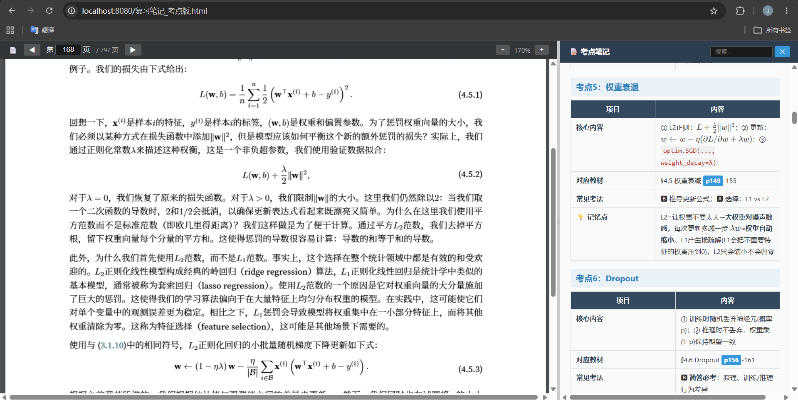

# Interactive Exam Review Page Generator

根据教材 PDF 自动生成交互式复习页面：左栏 PDF 教材 + 右栏考点笔记，**支持多 PDF 切换**和**跨文件页码跳转**。

## 效果预览



*（示例：深度学习期末复习，教材为《动手学深度学习》(D2L)）*

## 功能特性

- **左右分栏**：左侧 PDF 教材，右侧考点笔记，可拖拽调整宽度
- **多 PDF 支持**：工具栏下拉框切换不同教材，各自独立记忆页码位置
- **跨文件跳转**：笔记中写 `讲义三 p42` 即可点击后自动切换 PDF 并跳转
- **页码跳转**：点击笔记中的页码链接（如 `p105`），PDF 自动跳转到对应页
- **缩放控制**：+/- 按钮 或 Ctrl+滚轮 缩放（步长 0.1）
- **键盘快捷键**：← → 翻页，+/- 缩放
- **笔记搜索**：实时搜索高亮笔记内容
- **公式渲染**：KaTeX 渲染 LaTeX 公式
- **右键高亮**：在 PDF 文字上选中文本后右键，添加荧光笔高亮
- **响应式**：移动端自动上下排列

## 使用方法

### 1. 准备目录

```
your-project/
├── 教材1.pdf                # PDF 教材文件（可多个）
├── 教材2.pdf
├── 复习笔记_考点版.md        # 考点笔记
└── generate_review_page.py  # 本仓库的生成脚本
```

### 2. 配置脚本

编辑 `generate_review_page.py` 顶部的 `PDF_FILES` 配置：

```python
PDF_FILES = {
    "讲义一":  {"file": "博弈论补充讲义（一）.pdf", "offset": 0, "label": "讲义一"},
    "讲义二":  {"file": "博弈论补充讲义（二）.pdf", "offset": 0, "label": "讲义二"},
    "default": {"file": "参考资料.pdf", "offset": 0, "label": "综合参考资料"},
}
DEFAULT_PDF_KEY = "default"
```

> **如何确定偏移量？** 在 PDF 正文中找到印刷第 1 页，看它在 PDF 中是第几页。例如正文第 1 页 = PDF 第 19 页，则 offset = 18。用 `python3 generate_review_page.py --scan` 可快速查看文件列表。

### 3. 生成 HTML

```bash
pip install markdown
python3 generate_review_page.py
```

### 4. 启动查看

```bash
python3 -m http.server 8080
```

浏览器打开 `http://localhost:8080/复习笔记_考点版.html`

> ⚠️ 浏览器安全策略限制 file:// 协议加载 PDF。请使用 HTTP 服务器或用 Firefox 打开。

## 考点笔记格式

`复习笔记_考点版.md` 使用 markdown 表格组织，每条考点包含：

| 项目 | 内容 |
|------|------|
| **核心内容** | 公式、定义、概念（LaTeX `$...$`） |
| **对应教材** | 文件标识 + 印刷页码，如 `讲义三 §3.4 p105-p111` |
| **常见考法** | 题型标注：🅰选择/🅱简答/🅲计算 |
| **💡 记忆点** | 口诀、对比、类比 |

### 跨文件引用

笔记中两种页码引用格式：

| 格式 | 示例 | 行为 |
|------|------|------|
| `p105` | 当前教材第105页 | 跳转当前 PDF |
| `讲义三 p42` | 讲义三第42页 | **自动切换**到"讲义三"PDF 并跳转第42页 |

> 文件标识（如"讲义三"）必须与 `PDF_FILES` 配置中的键名完全一致。

## 命令行工具

```bash
python3 generate_review_page.py                # 使用预设配置生成
python3 generate_review_page.py --scan          # 扫描当前目录 PDF 并输出配置模板
python3 generate_review_page.py --scan --apply  # 扫描并直接用结果生成
```

## Claude Code Skill 自动生成

本工具的工作流已封装为 Claude Code 的 `exam-review` skill：

```bash
# 在项目目录中运行 Claude Code
/exam-review ./教材目录/
```

skill 会自动完成：
1. 扫描目录下所有 PDF，识别"讲义N"命名模式
2. 分析各 PDF 结构（页数、页码偏移）
3. 与你确认考点范围
4. 生成考点笔记 `复习笔记_考点版.md`（含跨文件引用）
5. 配置并运行 `generate_review_page.py`
6. 启动 HTTP 服务器

## 示例

本仓库的示例基于《动手学深度学习 (PyTorch第二版)》([D2L 开源书籍](https://d2l.ai))，包含：
- `复习笔记_考点版.md` — 35 个考点的深度学习复习笔记
- `generate_review_page.py` — 生成脚本（可配置多 PDF）
- `动手学深度学习-PyTorch(第二版).pdf` — 教材 PDF
