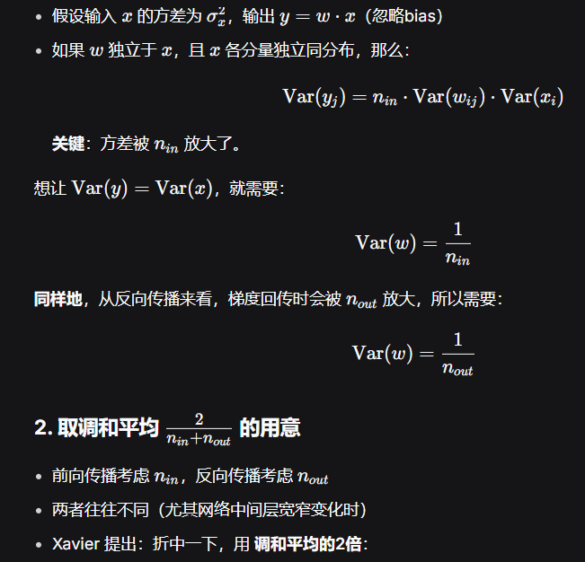
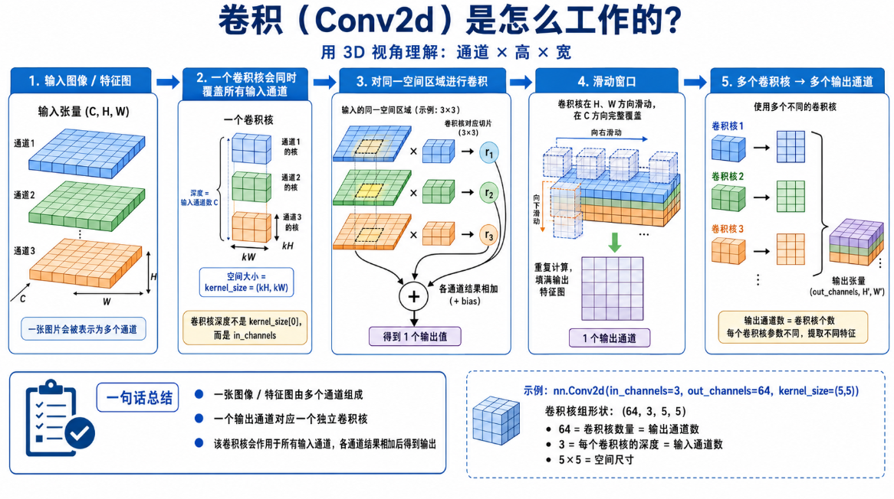
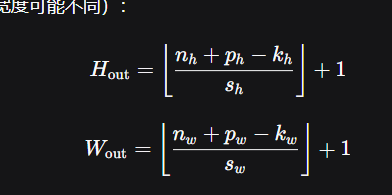
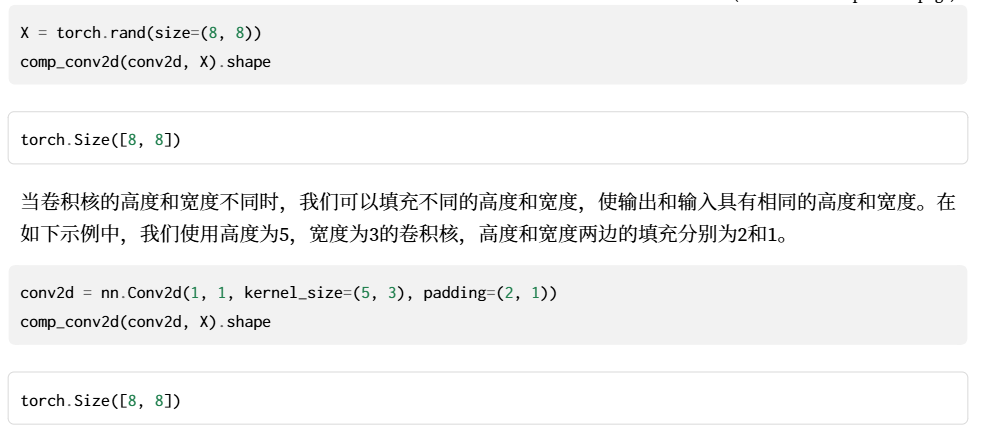

# 深度学习期末复习笔记（考点版）

> 按考点编排，每个考点标注：核心内容 + 对应教材 + 考法 + 💡 记忆点
>
> 教材：《动手学深度学习》PyTorch 第二版

---

## 一、深度学习基础

### 考点1：线性回归

| 项目 | 内容 |
| --- | --- |
| **核心内容** | ① 模型 $\hat{y}=Xw+b$；② 均方损失 $L=\frac{1}{2n}\sum(\hat{y}-y)^2$；③ 解析解 $w^*=(X^TX)^{-1}X^Ty$；④ SGD：$w \leftarrow w-\eta\frac{1}{\lvert B\rvert}\sum\partial_w L^{(i)}$；⑤ 从高斯噪声MLE导出MSE |
| **对应教材** | §3.1 线性回归 p85-95；§3.2 从零实现 p95-100；§3.3 简洁实现 p100-104 |
| **常见考法** | 🅱 **简答**：手推梯度、对比GD/SGD/Mini-batch GD；🅲 **代码**：从零实现；🅰 选择：解析解条件 |
| **💡 记忆点** | **S**tochastic **G**radient **D**escent = **随机**梯度下降，每次只用小批量不是全量数据。MSE前的1/2是为了求导消掉系数2。解析解就是最小二乘法的矩阵形式 |

### 考点2：Softmax回归

| 项目 | 内容 |
| --- | --- |
| **核心内容** | ① Softmax运算 $\hat{y}_j=e^{o_j}/\sum_k e^{o_k}$；② 交叉熵损失 $L=-\log\hat{y}_c$；③ 信息论：自信息 $I(x)=-\log P(x)$，熵 $H[P]=-\sum P(x)\log P(x)$，KL散度；④ $nn.CrossEntropyLoss()$ = LogSoftmax + NLLLoss |
| **对应教材** | §3.4 p105-111；§3.5 p111-114；§3.6-3.7 实现 p115-126 |
| **常见考法** | 🅱 **必考推导**：$\partial L/\partial o_j$（$j=c$→$\hat{y}_c-1$，$j\neq c$→$\hat{y}_j$）；🅲 代码实现 |
| **💡 记忆点** | Softmax把得分(odds)压成概率分布。交叉熵只关心正确类概率→概率越接近1，损失越接近0。**必记求导**：输出减真实 $\hat{y}-y$（$y$是one-hot） |

### 考点3：多层感知机 & 激活函数

| 项目 | 内容 |
| --- | --- |
| **核心内容** | ① MLP：$H=\sigma(XW^{(1)}+b^{(1)})$，$O=HW^{(2)}+b^{(2)}$；② 无激活函数→等价单层线性；③ ReLU=$max(0,x)$；Sigmoid=$1/(1+e^{-x})$；Tanh |
| **对应教材** | §4.1 p127-133；§4.2-4.3 实现 p134-138 |
| **常见考法** | 🅱 **简答必考**：对比三种激活函数优缺点；🅲 代码：`nn.Sequential(Linear→ReLU→Linear)` |
| **💡 记忆点** | 无激活=线性复合=一层。**ReLU**：负=0正=x→梯度不饱和→默认选择。**Sigmoid**：输出[0,1]但两端梯度≈0→深层不好。**Tanh**：输出[-1,1]梯度比Sigmoid稍好但也会饱和 |

### 考点4：模型选择、过拟合与欠拟合

| 项目 | 内容 |
| --- | --- |
| **核心内容** | ① 训练误差 vs 泛化误差；② 验证集 & K折交叉验证；③ **过拟合**：训练低、验证高→模型太复杂/数据少；④ **欠拟合**：两者都高→模型太简单 |
| **对应教材** | §4.4 过拟合和欠拟合 p139-149 |
| **常见考法** | 🅱 **简答必考**：给学习曲线判断+策略 |
| **💡 记忆点** | 过拟合=**考卷全对但换个题就不会**。欠拟合=**根本没学会**。判断口诀：**训低验高=过，双高=欠**。过拟合→正则化+增数据+降复杂度；欠拟合→增复杂度+降正则化 |

### 考点5：权重衰退

| 项目 | 内容 |
| --- | --- |
| **核心内容** | ① L2正则：$L+\frac{\lambda}{2}\lVert w\rVert^2$；② 更新：$w \leftarrow w-\eta(\partial L/\partial w + \lambda w)$；③ `optim.SGD(..., weight_decay=λ)` |
| **对应教材** | §4.5 权重衰减 p149-155 |
| **常见考法** | 🅱 推导更新公式；https://chat.deepseek.com/a/chat/s/27b91a98-a74e-4c39-8577-d02e5c575b2b 🅰 选择：L1 vs L2 |
| **💡 记忆点** | L2=让权重不要太大→**大权重对噪声敏感**。每次更新多减一步 $\lambda w$≈**权重自动缩小**。L1产生稀疏解(L1会把不重要特征的权重压到0)，L2只会缩小不会归零 |

### 考点6：Dropout

| 项目 | 内容 |
| --- | --- |
| **核心内容** | ① 训练时随机丢弃神经元(概率p)；② 推理时不丢弃，权重乘(1-p)保持期望一致 |
| **对应教材** | §4.6 Dropout p156-161 |
| **常见考法** | 🅱 **简答必考**：原理、训练/推理行为差异 |
| **💡 记忆点** | Dropout = **每步随机关一些神经元**→逼网络不依赖特定路径→类似**集成学习**。训练=随机丢，测试=全部用但要**缩权**(乘1-p)。面试**必问**：为什么测试要乘(1-p)？→保持期望一致 |

丢弃np个，保留n(1-p)个，为了保持输出一致，则保留的需要被放大。

假设输出为y，则输入Σx需要放大到y/n(1-p)，也就是每个x放大到y/(1-p)

### 考点7：数值稳定性 & 模型初始化

| 项目 | 内容 |
| --- | --- |
| **核心内容** | ① 梯度消失：sigmoid饱和→梯度→0→深层不动；② 梯度爆炸：梯度指数增长→NaN；③ Xavier $Var=2/(n_{in}+n_{out})$（sigmoid/tanh）；④ He $Var=2/n_{in}$（ReLU） |
| **对应教材** | §4.8 p166-169；§4.7 前向/反向传播 p162-165 |
| **常见考法** | 🅱 **简答必考**：原因+解决方案(初始化/BN/ReLU/残差连接) |
| **💡 记忆点** | 梯度消失=**信号传不到深层就没了**。梯度爆炸=**传着传着炸了**。解决四件套：**①初始化 ②BN ③ReLU ④残差连接**。Xavier名字带X （https://chat.deepseek.com/a/chat/s/d3476186-f9e3-4726-9dd9-ae176b7eade0） →适合sigmoid/tanh(对称)，He姓H→适合ReLU |

Xavier初始化其实就是让每一层根据自己的输入输出维度，独立地调整权重方差，从而使得信号（无论是前向的激活值还是反向的梯度）在穿过每一层时，方差都尽量保持不变。




---

## 二、卷积神经网络（CNN）

### 考点8：LeNet（含卷积基础）

| 项目 | 内容 |
| --- | --- |
| **核心内容** | Conv(5×5,6)→Pool→Conv(5×5,16)→Pool→FC120→FC84→FC10；卷积公式 $O=(W-K+2P)/S+1$；填充步幅 |
| **对应教材** | §6.1-6.6 p217-245 |
| **常见考法** | 🅱 画架构图；🅲 代码搭建；🅰 **计算题必考**：给尺寸算输出、卷积次数计算 |
| **💡 记忆点** | **Conv两大特性**：局部连接+权值共享→参数大减。输出公式：$O=(W-K+2P)/S+1$→W=32,K=5,P=2,S=1则O=32（same卷积）。LeNet=最早成功CNN=卷积→池化→全连接 |

图像模型的两个原则：

1. **平移不变性：**不管检测对象出现在图像中的哪个位置，神经网络的前面几层
   应该对相同的图像区域具有相似的反应，即为“平移不变性”。
2. **局部性**：神经网络的前面几层应该只探索输入图像中的局部区域，而不过度在意图像中相隔
   较远区域的关系，这就是“局部性”原则。最终，可以聚合这些局部特征，以在整个图像级别进行预测。

卷积核完整参数包括：  kernel_size（高, 宽）  stride（步长）  padding（填充）  dilation（空洞率），卷积核的深度必须等于输入通道数





```python
# 构造一个二维卷积层，它具有1个输出通道和形状为（1，2）的卷积核
conv2d = nn.Conv2d(1,1, kernel_size=(1, 2), bias=False)
# 这个二维卷积层使用四维输入和输出格式（批量大小、通道、高度、宽度），
# 其中批量大小和通道数都为1
X = X.reshape((1, 1, 6, 8))
Y = Y.reshape((1, 1, 6, 7))
lr = 3e-2 # 学习率
for i in range(10):
Y_hat = conv2d(X)
l = (Y_hat - Y) ** 2
conv2d.zero_grad()
l.sum().backward()
# 迭代卷积核
conv2d.weight.data[:] -= lr * conv2d.weight.grad
if (i + 1) % 2 == 0:
print(f'epoch {i+1}, loss {l.sum():.3f}')
```

假设输入形状为n_h × n_w，卷积核形状为k_h × k_w，那么输出形状将是(n_h − k_h + 1) × (n_w − k_w + 1)

引入padding：(n_h − k_h + p_h + 1) × (n_w − k_w + p_w + 1)

引入stride：[(n_h − k_h + p_h + s_h)/s_h] × ⌊(n_w − k_w + p_w + s_w)/s_w]. (相比前面两条，没有+1，因为实际上前面两条的stride就是1)

*这里的p_h不是函数参数的p，PyTorch 的 nn.Conv2d(padding=...) 中，参数 padding 表示的是每一边填充的数量。所以一般**p是要乘以2**再带入公式。

最终的公式（p记得乘以2）：





1×1卷积：不再识别相邻元素，而是仅做通道之间的运算：从深度维度上（输入的每个通道乘以一个卷积核加和，即得到一个输出通道的值）进行加和与大小缩放处理。平面大小不变，通道数改变。

汇聚层：池化层，分为max pooling、mean pooling等。（通常当我们处理图像时，我们希望逐渐降低隐藏表示的空间分辨率、聚集信息，这样随着我们在神经网络中 层叠的上升，每个神经元对其敏感的感受野（输入）就越大）。p254

每个卷积块中的基本单元是一个卷积层、一个sigmoid激活函数和平均汇聚层。

torch.Size([1, 1, 28, 28])：

| 维度索引 | 维度大小 | 含义 |
| --- | --- | --- |
| 0 | 1 | 批次大小 (Batch Size)：表示有 1 个样本。 |
| 1 | 1 | 通道数 (Channels)：表示是单通道图像，例如灰度图。 |
| 2 | 28 | 高度 (Height)：图像的高度为 28 像素。 |
| 3 | 28 | 宽度 (Width)：图像的宽度为 28 像素。 |

nn.Linear(120, 84)：输入为120维，输出为84维。即X为[n,120]，通过线性层后输出为[n,84]。

### 考点9：AlexNet

| 项目 | 内容 |
| --- | --- |
| **核心内容** | 5 Conv+3 FC；创新：**ReLU、Dropout、数据增强、GPU并行** |
| **对应教材** | §7.1 AlexNet p248-255 |
| **常见考法** | 🅱 简答：AlexNet vs LeNet |
| **💡 记忆点** | AlexNet=LeNet加**深**+**ReLU**+**Dropout**+**数据增强**。2012年ImageNet夺冠→深度学习复兴标志。**记住四个关键词：ReLU(加速)、Dropout(防过拟合)、数据增强(扩数据)、GPU(并行)** |

AlexNet和LeNet的设计理念非常相似，但也存在显著差异。

1. AlexNet比相对较小的LeNet5要深得多。AlexNet由八层组成：五个卷积层、两个全连接隐藏层和一个
   全连接输出层。
2. AlexNet使用ReLU而不是sigmoid作为其激活函数。
3. AlexNet通过暂退法（4.6节）控制全连接层的模型复杂度，而LeNet只使用了权重衰减。
4. 为了进一步扩充数据（减少过拟合），AlexNet在训练时增加了大量的图像增强数据，如翻转、裁切和变色。
5. 与 6.6节中的LeNet相比，训练的主要变化是使用更小的学习速率训练，这是因为网络更深更广、图像分辨率更高，训练卷积神经网络就更昂贵。（模型越复杂，不同的参数组合可能对应非常相似的损失值，也就是说损失函数会更崎岖，因此学习率（步长）需要小）

### 考点10：VGG

| 项目 | 内容 |
| --- | --- |
| **核心内容** | VGG块=多个3×3 Conv+2×2 Pool；两个3×3=一个5×5感受野（参数更少+非线性更多） |
| **对应教材** | §7.2 VGG p255-258 |
| **常见考法** | 🅱 简答：为什么堆叠小卷积核 |
| **💡 记忆点** | 两个3×3 vs 一个5×5→**感受野一样**但参数从25变成18(2×9)。还多了**一层非线性**。VGG=**简单堆叠**，网络块状设计思想→影响后续ResNet |

经典卷积神经网络的基本组成部分是下面的这个序列：

1. 带填充以保持分辨率的卷积层；
2. 非线性激活函数，如ReLU；
3. 汇聚层，如最大汇聚层。

而一个VGG块与之类似，由一系列卷积层组成，后面再加上用于空间下采样的最大汇聚层。

def vgg_block(num_convs, in_channels, out_channels)

P275 计算

### 考点11：NiN

| 项目 | 内容 |
| --- | --- |
| **核心内容** | MLPConv(Conv后接1×1 Conv)+全局平均池化代替FC |
| **对应教材** | §7.3 NiN p259-262 |
| **常见考法** | 🅰 选择：创新点 |
| **💡 记忆点** | NiN=**Network in Network**→在Conv里嵌入微型MLP(1×1 Conv)。全局平均池化取代FC→**参数量大降** |

### 考点12：GoogLeNet

| 项目 | 内容 |
| --- | --- |
| **核心内容** | Inception块：1×1,3×3,5×5 Conv+3×3 Pool四路并行→通道拼接；1×1 Conv做bottleneck降维 |
| **对应教材** | §7.4 GoogLeNet p263-267 |
| **常见考法** | 🅱 简答：Inception设计思想 |
| **💡 记忆点** | Inception=**多尺度并行**→不同大小卷积核捕捉不同范围特征。1×1 Conv做bottleneck=**先降维再卷积**→计算量骤减。名字致敬《盗梦空间》 |

### 考点13：ResNet ⭐最重要

| 项目 | 内容 |
| --- | --- |
| **核心内容** | ① **退化问题** vs 过拟合；② 残差块 $y=F(x)+x$；③ 瓶颈1×1→3×3→1×1；④ **梯度直通**：$\partial Loss/\partial x_l = \partial Loss/\partial x_L \cdot (1 + \partial/\partial x_l \sum F)$ |
| **对应教材** | §7.6 ResNet p275-288 |
| **常见考法** | 🅱 **简答必考**：为什么能训练更深网络 |
| **💡 记忆点** | 退化=**层多了反而更差**（不是过拟合！）。残差连接=**给梯度开了一条高速公路**，梯度可以直接跳过权重层传回去。瓶颈设计=**两头宽中间窄**。记住公式 $y=F(x)+x$，**x这条恒等路径是整个ResNet的精髓** |

---

## 三、循环神经网络（RNN）

### 考点14：RNN

| 项目 | 内容 |
| --- | --- |
| **核心内容** | ① $H_t=\phi(X_tW_{xh}+H_{t-1}W_{hh}+b_h)$；② **参数共享**（每步用一样）；③ 困惑度 $Perplexity=\exp(-\frac1n\sum\log P(x_t \mid x_{\lt t}))$（越小越好）；④ 梯度裁剪 $g \leftarrow \min(1,\theta/\lVert g\rVert) \cdot g$；⑤ BPTT：沿时间展开计算图 |
| **对应教材** | §8.4-8.7 p312-332 |
| **常见考法** | 🅱 公式手写、BPTT原理、RNN梯度问题；🅲 代码：梯度裁剪 |
| **💡 记忆点** | RNN核心=**把上一时刻的隐状态传给下一时刻**，$W_{hh}$是循环核心。参数共享=**每步用同一组$W$**，所以展开后梯度连乘→指数消失/爆炸。困惑度=**模型猜下一个词的"困惑程度"**，1最好无限大最差。梯度爆炸→裁剪，消失→LSTM/GRU |

### 考点15：GRU

| 项目 | 内容 |
| --- | --- |
| **核心内容** | 重置门$R_t$=忘多少；更新门$Z_t$=留多少。$\tilde{H}_t=\tanh(X_tW_{xh}+(R_t\odot H_{t-1})W_{hh})$，$H_t=Z_t\odot H_{t-1}+(1-Z_t)\odot\tilde{H}_t$ |
| **对应教材** | §9.1 GRU p333-341 |
| **常见考法** | 🅱 **简答必考**：缓解梯度消失的原因 |
| **💡 记忆点** | GRU = 只**两个门**：重置门≈**决定忘多少过去**，更新门≈**决定用多少新信息**。当更新门=1时 $H_t=H_{t-1}$→**信息完全保留**→梯度消失缓解。比LSTM更轻量 |

### 考点16：LSTM

| 项目 | 内容 |
| --- | --- |
| **核心内容** | 遗忘门$F_t$、输入门$I_t$、输出门$O_t$；$C_t=F_t\odot C_{t-1}+I_t\odot\tilde{C}_t$；$H_t=O_t\odot\tanh(C_t)$ |
| **对应教材** | §9.2 LSTM p341-349 |
| **常见考法** | 🅱 **必考**：手写三门公式；🅱 对比LSTM vs GRU |
| **💡 记忆点** | LSTM = **三个门** + **一条记忆带$C_t$**。$C$像传送带贯穿整个序列→信息长期保留。**遗忘门**=清除旧记忆；**输入门**=写入新记忆；**输出门**=决定展示什么。vs GRU：LSTM有独立$C_t$更灵活但参数多，GRU更轻量效果相当 |

### 考点17：深层RNN & 双向RNN

| 项目 | 内容 |
| --- | --- |
| **核心内容** | 深层=多层堆叠；双向=前向+后向拼接 |
| **对应教材** | §9.3 p349-352；§9.4 p352-357 |
| **常见考法** | 🅰 **易错选择**：双向能否用于LM？→**不能**(看到了未来) |
| **💡 记忆点** | 深层=**竖着叠**（每层输出是下层输入）；双向=**横着看两边**。**必记陷阱**：双向RNN做语言模型=**作弊**（预测下一个词时看到了后面的词） |

### 考点18：Seq2Seq

| 项目 | 内容 |
| --- | --- |
| **核心内容** | ① 编码器-解码器；② Teacher Forcing（用真实输出当输入）；③ BLEU评分；④ 束搜索k=1=贪心 |
| **对应教材** | §9.6-9.8 p364-380 |
| **常见考法** | 🅱 简答：Teacher Forcing、Beam Search |
| **💡 记忆点** | Seq2Seq=**编码器压缩→解码器展开**。Teacher Forcing=**训练时给正确答案**→收敛快但测试时一步错步步错(暴露偏差)。Beam Search=**每一步保留k条路**不是只走一条。k=1退化为贪心 |

### 考点19：语言模型

| 项目 | 内容 |
| --- | --- |
| **核心内容** | 估计序列概率$P(x_1,...,x_T)$；n-gram=$n-1$阶马尔可夫；文本预处理：词元化→词表→数值化 |
| **对应教材** | §8.2 p298-302；§8.3 p303-312 |
| **常见考法** | 🅰 选择：n-gram含义、特殊标记作用 |
| **💡 记忆点** | n-gram=**只看前n-1个词预测第n个**。$\lt$unk$\gt$=未见过的词，$\lt$pad$\gt$=填充对齐，$\lt$bos$\gt$/$\lt$eos$\gt$=起止标记 |

---

## 四、注意力机制

### 考点20：注意力机制基础

| 项目 | 内容 |
| --- | --- |
| **核心内容** | ① **QKV框架**：Q问K，K答score，加权V；② 加性注意力 $a(q,k)=w_v^T\tanh(W_qq+W_kk)$；③ 缩放点积 $a(q,k)=q^Tk/\sqrt{d}$；④ 多头 $MultiHead=Concat(head)W_O$；⑤ 自注意力 Q=K=V |
| **对应教材** | §10.1-10.3 p381-398；§10.5 p404-408；§10.6 p408-413 |
| **常见考法** | 🅱 为什么除以$\sqrt{d}$(防softmax太极端)；为什么多头(多子空间学不同模式)；为什么位置编码(置换不变性)；🅰 复杂度对比 |
| **💡 记忆点** | 注意力本质=**Query检索Key, 取出Value**。缩放点积除以$\sqrt{d}$→**softmax输入太大梯度会消失**。多头=**多个视角并行看同一段话**。自注意力=QKV都来自自己→**句子内部算关联**。复杂度：自注意力$O(n^2d)$ vs RNN $O(nd^2)$→序列长时自注意力贵 |

### 考点21：Seq2Seq + 注意力

| 项目 | 内容 |
| --- | --- |
| **核心内容** | Bahdanau注意力：解码每步动态看源序列不同位置→不依赖单一上下文向量 |
| **对应教材** | §10.4 Bahdanau注意力 p399-403 |
| **常见考法** | 🅱 简答：注意力如何改进Seq2Seq |
| **💡 记忆点** | 原始Seq2Seq=**只看最后一个隐状态**（信息瓶颈）。加注意力=**每一步回头看源序列全部**→不丢失信息，更灵活 |

### 考点22：Transformer ⭐最重要

| 项目 | 内容 |
| --- | --- |
| **核心内容** | ① **编码器**(N=6)：多头自注意力→Add&Norm→FFN→Add&Norm；② **解码器**(N=6)：掩蔽多头自注意力→Add&Norm→交叉注意力→Add&Norm→FFN→Add&Norm；③ FFN=$\max(0,xW_1+b_1)W_2+b_2$；④ 残差连接$x+Sublayer(x)$；⑤ **LayerNorm**(同层归一化) vs **BatchNorm**(同batch归一化)；⑥ 位置编码 $PE_{(pos,2i)}=\sin(pos/10000^{2i/d})$ |
| **对应教材** | §10.7 p413-426；§10.6 位置编码 p410-413 |
| **常见考法** | 🅱 **终极必考题**：画出架构图！为什么用LN不用BN？解码器掩蔽原因 |
| **💡 记忆点** | **架构速记**：编6解6+自注意力+交叉注意力+FFN+残差+LN。**LN vs BN核心区别**：BN对batch归一化→序列变长时统计不稳；**LN对每个样本自己归一化**→不受batch影响。解码器**掩蔽**=不让看到未来的词。Transformer=**纯注意力，无RNN/CNN**→BERT/GPT全是它 |

### 考点23：BERT

| 项目 | 内容 |
| --- | --- |
| **核心内容** | ① 多层Transformer编码器(双向)；② **MLM**：mask 15%(80%→[MASK],10%随机,10%不变)；③ **NSP**：下句预测；④ 输入=Token+Segment+Position Embedding；⑤ [CLS][SEP] |
| **对应教材** | §14.8 BERT p679-691；§14.9-14.10 p692-702 |
| **常见考法** | 🅱 **简答必考**：预训练任务、为什么MLM好(双向) |
| **💡 记忆点** | BERT=**双向Transformer编码器**。MLM=**盖住让你猜**→上下文都看到了所以是双向。NSP=**两句话是否连续**→理解句子关系。BERT_base(12层,768维,12头)≈**2.2亿参数**。**注意区别**：BERT是编码器(GPT是解码器) |

---

## 五、计算机视觉

### 考点24：图片增广

| 项目 | 内容 |
| --- | --- |
| **核心内容** | 翻转、裁剪、颜色抖动(亮度/对比度/饱和度/色相)；训练时增广，测试时仅标准化 |
| **对应教材** | §13.1 图像增广 p549-557 |
| **常见考法** | 🅰 选择：哪些方法 |
| **💡 记忆点** | 增广=**免费数据扩增**。测试时不能随机增广→结果不稳定 |

### 考点25：微调 ⭐必考

| 项目 | 内容 |
| --- | --- |
| **核心内容** | ①加载预训练模型→②替换输出层→③输出层随机初始化→④微调(输出层大lr，其余小lr) |
| **对应教材** | §13.2 微调 p557-563 |
| **常见考法** | 🅱 **简答必考**：步骤+为什么有效 |
| **💡 记忆点** | 微调=**站在巨人肩膀上**。预训练模型已经学会通用特征(边缘/纹理)，只需少量调整适配新任务。数据少时千万要用微调别从头训 |

### 考点26：物体检测（R-CNN/SSD/YOLO）

| 项目 | 内容 |
| --- | --- |
| **核心内容** | ① 边界框、锚框、IoU、NMS；② **R-CNN**(选→提→分→回归)；③ **Fast**(共享CNN+RoI池化)；④ **Faster**(RPN代替选择性搜索)；⑤ **SSD**(多尺度)；⑥ **YOLO**(单阶段) |
| **对应教材** | §13.3-13.8 p564-605 |
| **常见考法** | 🅱 演进过程；🅰 概念 |
| **💡 记忆点** | R-CNN演进=**越来越快**。R-CNN=每个候选框都过CNN→慢。Fast=整图一次CNN→快。Faster=RPN自提框→更快。**两阶段**(R-CNN系) vs **一阶段**(YOLO/SSD)：两阶段准但慢，一阶段快但差一点 |

### 考点27：语义分割 & FCN

| 项目 | 内容 |
| --- | --- |
| **核心内容** | 语义分割=像素级分类；FCN=全卷积+转置卷积上采样 |
| **对应教材** | §13.9-13.11 p605-623 |
| **常见考法** | 🅰 选择：语义vs实例分割；🅱 简答：转置卷积作用 |
| **💡 记忆点** | 语义分割=**每个像素分类**(所有车标红)。实例分割=**每个物体单独标**(车1红,车2蓝)。FCN=**把FC层全换成Conv**→输入任意尺寸→输出同尺寸分割图 |

### 考点28：样式迁移

| 项目 | 内容 |
| --- | --- |
| **核心内容** | 内容损失(像素相似)+风格损失(Gram矩阵匹配)联合优化 |
| **对应教材** | §13.12 风格迁移 p624-632 |
| **常见考法** | 🅰 选择：概念 |
| **💡 记忆点** | 内容=**看起来像原图**，风格=**纹理色彩像名画**(Gram矩阵算特征图之间的相关性) |

---

## 六、NLP应用

### 考点29：机器翻译

| 项目 | 内容 |
| --- | --- |
| **核心内容** | Seq2Seq+注意力+BLEU（见考点18、21） |
| **对应教材** | §9.5 机器翻译 p357-362 |
| **常见考法** | 🅱 综合：Seq2Seq+注意力串联 |

### 考点30：自然语言推理（NLI）

| 项目 | 内容 |
| --- | --- |
| **核心内容** | 判断两句话关系：蕴含/矛盾/中性 |
| **对应教材** | §15.4 p719-723；§15.5 p724-730 |
| **常见考法** | 🅰 选择：任务定义 |
| **💡 记忆点** | NLI=**"A句→B句"成立吗？** 例如："猫在睡觉"→"动物在休息"=蕴含；"猫在睡觉"→"猫在跑步"=矛盾 |

### 考点31：BERT微调应用

| 项目 | 内容 |
| --- | --- |
| **核心内容** | ① 单文本分类：[CLS]→FC→Softmax；② 文本对： [CLS]A[SEP]B[SEP]→FC；③ 文本标注：每token→FC |
| **对应教材** | §15.6 微调BERT p731-740 |
| **常见考法** | 🅱 简答：不同任务怎么配输出层 |
| **💡 记忆点** | [CLS]存整句信息→**分类用CLS**。标注每个词都要预测→**每个token出标签**。文本对→**A和B拼一起送进去** |

---

## 七、性能

### 考点32：CPU / GPU / ASIC

| 项目 | 内容 |
| --- | --- |
| **核心内容** | CPU少核→串行；GPU多核(SIMT)→并行矩阵；ASIC专为特定计算(TPU) |
| **对应教材** | §12.4 硬件 p517-527 |
| **常见考法** | 🅰 选择：为什么GPU适合DL |
| **💡 记忆点** | CPU=**几个聪明人**做复杂事；GPU=**一万个普通人**做简单数学。DL=矩阵乘法→GPU天然优势 |

### 考点33：多GPU & 分布式

| 项目 | 内容 |
| --- | --- |
| **核心内容** | **数据并行**：每GPU一份模型→分数据→前向→损失→反向→梯度AllReduce→更新；Ring AllReduce去中心化 |
| **对应教材** | §12.5-12.7 p528-548 |
| **常见考法** | 🅱 简答：数据并行步骤；🅰 选择概念 |
| **💡 记忆点** | 数据并行=**一人一份模型，分数据算梯度，然后汇总**。Ring AllReduce=**围成一圈传梯度**，不用中心服务器→效率高。瓶颈：**通信**(GPU间传梯度比算梯度还慢) |

---

## 八、综合应用（Kaggle实战）

### 考点34：房价预测

| 项目 | 内容 |
| --- | --- |
| **核心内容** | 数据预处理→特征工程→MLP→K折交叉验证→集成 |
| **对应教材** | §4.10 p180-188 |
| **💡 记忆点** | Kaggle回归任务标准流程：清洗→处理缺失值→标准化→交叉验证选模型 |

### 考点35：图片分类

| 项目 | 内容 |
| --- | --- |
| **核心内容** | 图像增广+预训练模型微调；Kaggle犬种识别 |
| **对应教材** | §13.13-13.14 p633-648 |
| **💡 记忆点** | CV比赛标准套路：**预训练模型(如ResNet50)+微调+数据增广+集成** |

---

## 附录：按题型分类速查

### 🅰 选择题/填空题

| 考点 | 核心要点 |
| --- | --- |
| 广播机制 | (3,1)+(1,4)=(3,4) |
| 卷积输出尺寸 | O=(W-K+2P)/S+1 |
| 池化作用 | 降维、平移不变性 |
| 分布偏移类型 | 协变量/标签/概念偏移 |
| 激活函数特性 | ReLU默认选，Sigmoid/Tanh会饱和 |
| 优化器选择 | Adam最常用 |
| 困惑度含义 | 越小越好，1为理想 |
| n-gram | n阶马尔可夫 |
| Skip-Gram vs CBOW | 中心→上下文 vs 上下文→中心 |
| 双向RNN | **不能**用于语言模型 |
| CPU vs GPU | 并行 vs 串行 |
| 欠拟合/过拟合 | 训低验高=过，双高=欠 |
| 门控机制 | LSTM 3门 vs GRU 2门 |

### 🅱 简答题

| 考点 | 关键话术 |
| --- | --- |
| 过拟合解决 | 正则化+增数据+降复杂度 |
| 梯度消失/爆炸 | 初始化+BN+ReLU+残差 |
| Dropout | 训练随机丢，测试缩放 |
| BatchNorm | 训练用batch统计，推理用全局 |
| ResNet有效 | 残差连接梯度直通 |
| Transformer | 画架构图(编6解6+各子层) |
| 自注意力位置编码 | 置换不变性需要位置信息 |
| Adam公式 | 一阶矩+二阶矩+偏差校正 |
| 微调步骤 | 加载预训练→换输出层→微调 |
| BERT预训练 | MLM+NSP |
| LSTM/GRU公式 | 手写门控公式 |

### 🅲 代码题

| 考点 | 关键实现 |
| --- | --- |
| 线性回归 | 生成数据→Linear/MSELoss→SGD→训练循环 |
| Softmax+交叉熵 | CrossEntropyLoss / 手动softmax |
| MLP | nn.Sequential(Linear→ReLU→Linear) |
| LeNet | Conv2d→Pool→Conv2d→Pool→Linear |
| RNN训练 | nn.RNN/LSTM/GRU + 梯度裁剪 |
| autograd | backward + detach + grad |

---

*注：页码对应中文PDF内部页号。💡记忆点帮助理解和记忆，不是完整考点内容。*
